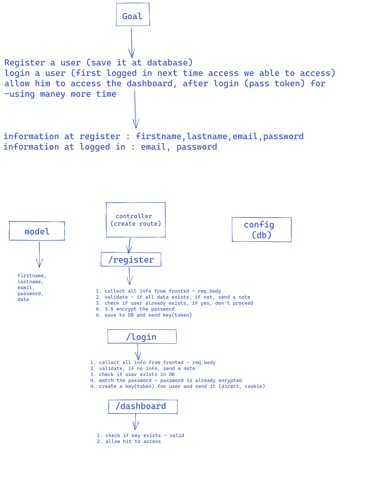

# JavaScript Bootcamp Project : Full Fledged FullStack Todo-Crud App

**By Saurabh**

## 🛑 YouTube Link 🛑
### 📌 **Link: (don't forget to check description also)** <a href="https://youtu.be/Kz_q610hY7k">**Visit Now** 🚀</a>

## 

## 

## 

---

## [GO LIVE](https://todo-crud-mern-application-kvk3.vercel.app/)

## Technologies used

> JavaScript

> HTML

> SCSS

> React

> express

> node

> mongoose

> mongoDB

---
## **Skill Gained in the project**
-  Learn about firstTime The Structure of FullStack Web Application. There working scenario, there Way How it's work actually How to take input from user and then stored it into a DB
& show the massage it's all.
-  Learn about CRUD operation How Create,READ,Upadate,& DELETE as well.
-  Learn about Postman how to check code, dubbgged and handling the API & and cheack wheather it's proper or Not.

****

## **Time taken to finished to be honest**

 it's Approximately more than **20 days** to understand the concept

---

## **Next Vision**
Think about hoisting on Railway and vercel. 
